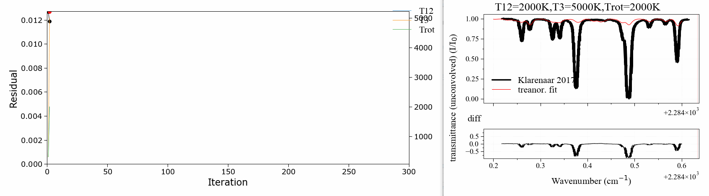
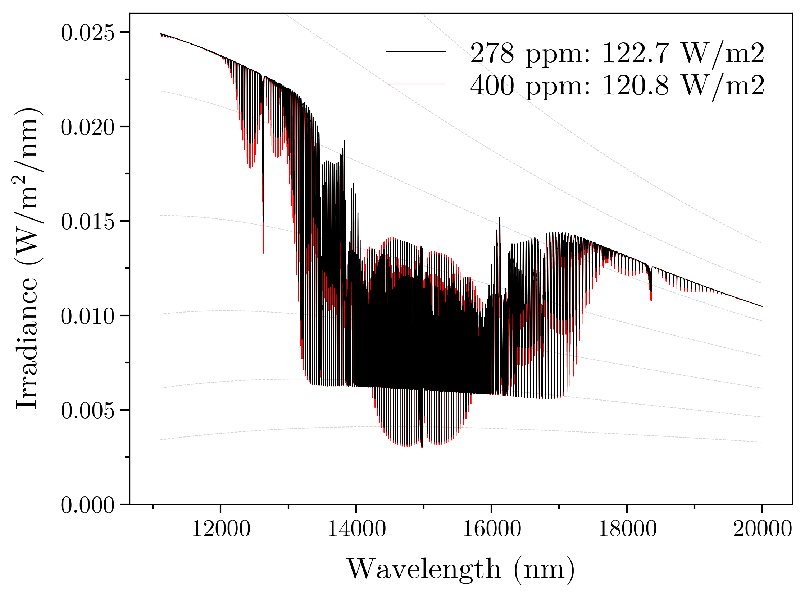

==============
RADIS Examples
==============

This project includes:

- Interactive examples to calculate infrared spectra of molecules with `RADIS <http://radis.readthedocs.io/>`__, a convenient way to have access to HITRAN online without any installation. 

- Static examples of fitting algorithm built around `RADIS <http://radis.readthedocs.io/>`__

Interactive Examples
--------------------

Run RADIS interactively directly from the browser. No installation needed!

1. `spectrum.ipynb <spectrum.ipynb>`_
~~~~~~~~~~~~~~~~~~~~~~~~~~~~~~~~~~~~

Manipulate a `Spectrum <http://radis.readthedocs.io/en/latest/source/radis.spectrum.spectrum.html#radis.spectrum.spectrum.Spectrum>`_ object:

.. image:: https://mybinder.org/badge.svg 
    :target: https://mybinder.org/v2/gh/radis/radis-examples/master?filepath=spectrum.ipynb
    :alt: https://mybinder.org/v2/gh/radis/radis-examples/master?filepath=spectrum.ipynb

2. `first_example.ipynb <first_example.ipynb>`_
~~~~~~~~~~~~~~~~~~~~~~~~~~~~~~~~~~~~~~~~~~~~~~~

Calculate CO equilibrium and nonequilibrium spectra:

.. image:: https://mybinder.org/badge.svg 
    :target: https://mybinder.org/v2/gh/radis/radis-examples/master?filepath=first_example.ipynb
    :alt: https://mybinder.org/v2/gh/radis/radis-examples/master?filepath=first_example.ipynb

3. `online_fitting.ipynb <online_fitting/online_fitting.ipynb>`_ (JupyterLab)
~~~~~~~~~~~~~~~~~~~~~~~~~~~~~~~~~~~~~~~~~~~~~~~~~~~~~~~~~~~~~~~~~~~~~~~~~~~~~

Import experimental spectra in an online JupyterLab instance and start fitting them!

.. image:: https://mybinder.org/badge.svg 
    :target: https://mybinder.org/v2/gh/radis/radis-examples/master?urlpath=lab/tree/online_fitting/online_fitting.ipynb
    :alt: https://mybinder.org/v2/gh/radis/radis-examples/master?urlpath=lab/tree/online_fitting/online_fitting.ipynb

4. `radis_online.ipynb <radis_online.ipynb>`_
~~~~~~~~~~~~~~~~~~~~~~~~~~~~~~~~~~~~~~~~~~~~~

Start a bare RADIS online session: 

.. image:: https://mybinder.org/badge.svg 
    :target: https://mybinder.org/v2/gh/radis/radis-examples/master?filepath=radis_online.ipynb
    :alt: https://mybinder.org/v2/gh/radis/radis-examples/master?filepath=radis_online.ipynb

`RADIS-lab <https://github.com/radis/radis-lab>`__
--------------------------------------------------

A full online environment for advanced spectrum processing and comparison with experimental data

.. image:: https://user-images.githubusercontent.com/16088743/103448773-7d8f0200-4c9e-11eb-8bf1-ce3385519b77.png
    :target: https://user-images.githubusercontent.com/16088743/103448773-7d8f0200-4c9e-11eb-8bf1-ce3385519b77.png
    :alt: radis-lab-wip-02-01-21
    
More on `radis-lab <https://github.com/radis/radis-lab>`__
    
.. image:: https://mybinder.org/badge.svg 
    :target: https://mybinder.org/v2/gh/radis/radis-lab/main?urlpath=lab/tree/compare_with_experiment.ipynb
    :alt: https://mybinder.org/v2/gh/radis/radis-lab/main?urlpath=lab/tree/compare_with_experiment.ipynb

Static Examples
---------------

`Install RADIS <https://radis.readthedocs.io/en/latest/install.html#install>`_ 
then run these examples locally. 

1. Multi Temperature Fit
~~~~~~~~~~~~~~~~~~~~~~~~

A 3 temperature fitting example reproducing the validation case of Klarenaar 2017 [1]_, who calculated a transmittance
spectrum from the initial data of Dang 1973 [2]_, with a 1 rotational temperature + 
3 vibrational temperature (Treanor distributions) model 

CO2 Energies are calculated from Dunham developments in an uncoupled harmonic 
oscillator - rigid rotor model. The example is based on one of `RADIS validation cases <https://github.com/radis/radis/tree/master/radis/test/validation>`_. 
It makes use of the RADIS `Spectrum <http://radis.readthedocs.io/en/latest/#the-spectrum-class>`_
class and the associated compare and load functions

.. [1] Klarenaar et al 2017, "Time evolution of vibrational temperatures in a CO2 glow 
       discharge measured with infrared absorption spectroscopy" doi/10.1088/1361-6595/aa902e

.. [2] Dang et al 1982, "Detailed vibrational population distributions in a CO2 laser 
        discharge as measured with a tunable diode laser" doi/10.1007/BF00694640

2. Radiative forcing of CO2 
~~~~~~~~~~~~~~~~~~~~~~~~~~~

An example where we use RADIS to calculate the upward-radiation of the Earth for different CO2 mole fractions 
in the atmosphere, based on the simple Standard Atmosphere Model. The difference evidences the radiative
forcing of CO2. 

Code is available in the `radiative_forcing_co2.py file <https://github.com/radis/radis-examples/blob/master/ex_radiative_forcing_co2/radiative_forcing_co2.py>`__

3. HITRAN spectra
~~~~~~~~~~~~~~~~~

The absorption coefficient of all HITRAN species is calculated in `plot_all_hitran_spectra.py <https://github.com/radis/radis-examples/blob/master/hitran_spectra/plot_all_hitran_spectra.py>`__ at 300 K, 1 atm for the first isotope.

For instance:

- Water (H2O) absorption coefficient at 300 K :

.. image:: hitran_spectra/out/0%20-%20H2O%20infrared%20spectrum.png
   :width: 600
   :alt: Water H2O infrared absorption coefficient

- Carbon dioxide (CO2) absorption coefficient at 300 K : 

.. image:: hitran_spectra/out/1%20-%20CO2%20infrared%20spectrum.png
   :width: 600
   :alt: Carbon Dioxide CO2 infrared absorption coefficient

- Methane (CH4) absorption coefficient at 300 K : 

.. image:: hitran_spectra/out/5%20-%20CH4%20infrared%20spectrum.png
   :width: 600
   :alt: Methane CH4 infrared absorption coefficient

All other species can be found `on the RADIS website <https://radis.readthedocs.io/en/latest/examples/examples.html#hitran-spectra>`__

Links
-----

- RADIS Documentation: http://radis.readthedocs.io/
- RADIS Source files: https://github.com/radis/radis
- PyPi project: https://pypi.python.org/pypi/radis
- Test status: https://travis-ci.org/radis/radis
- Test coverage: https://codecov.io/gh/radis/radis

